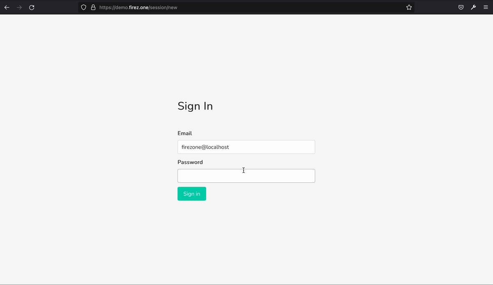

<p align="center">
  
</p>
<p align="center">
  <a href="https://github.com/firezone/firezone/releases">
    
  </a>
  <a href="https://e04kusl9oz5.typeform.com/to/zahKLf3d">
    
  </a>
  <a href="https://discourse.firez.one">
    
  </a>
  
  
  <a href="https://twitter.com/intent/follow?screen_name=firezonevpn">
    
  </a>
</p>


<p align="center">
  <strong>A self-managed <a href="https://www.wireguard.com/">WireGuard</a>-based VPN server and Linux firewall designed for simplicity and security.</strong>
</p>

<hr>


# Table of Contents
* [What is Firezone?](#what-is-firezone)
  * [Features](#features)
  * [Anti-features](#anti-features)
* [Deploying and Configuring](#deploying-and-configuring)
  * [Supported Linux Distributions](#supported-linux-distributions)
  * [Installation Instructions](#installation-instructions)
  * [Configuration File](#configuration-file)
* [Using Firezone](#using-firezone)
  * [Troubleshooting](#troubleshooting)
  * [Uninstalling](#uninstalling)
* [Getting Support](#getting-support)
* [Developing and Contributing](#developing-and-contributing)


# What is Firezone?

Firezone is a Linux package to manage your WireGuard VPN through a simple web interface.



## Features

- **Fast:** Uses WireGuard to be [3-4 times](https://wireguard.com/performance/) faster than OpenVPN.
- **No dependencies:** All dependencies are bundled thanks to
    [Chef Omnibus](https://github.com/chef/omnibus).
- **Simple:** Takes minutes to set up. Manage via a simple CLI API.
- **Secure:** Runs unprivileged. HTTPS enforced. Encrypted cookies.
- **Firewall included:** Uses Linux [nftables](https://netfilter.org) to block
    unwanted egress traffic.

## Anti-features

Firezone is **not:**

- An inbound firewall
- A tool for creating mesh networks
- A full-featured router
- An IPSec or OpenVPN server

# Deploying and Configuring

Firezone consists of a single distributable Linux package that you install and
manage yourself. Management of the Firezone installation is handled by the
`firezone-ctl` utility while management of the VPN and firewall themselves are
handled by the Web UI.

Firezone acts as a frontend to both the WireGuard kernel module and
[netfilter](https://netfilter.org) kernel subsystem. It creates a WireGuard
interface (by default called `wg-firezone`) and
`firezone` netfilter table and adds appropriate routes to the routing
table. Other programs that modify the Linux routing table or netfilter firewall
may interfere with Firezone's operation.

### SSL

Firezone requires a valid SSL certificate and a matching DNS record to run in
production. We recommend using [Let's Encrypt](https://letsencrypt.org) to
generate a free SSL cert for your domain.

### Security Considerations

Firezone is **beta** software. We highly recommend **limiting network access to
the Web UI** to prevent exposing it to the public Internet.

## Supported Linux Distributions

Firezone currently supports the following distributions and architectures:

| Name | Architectures | Status | Notes |
| --- | --- | --- | --- |
| CentOS 7 | `amd64` | **Fully-supported** | See [CentOS 7 Notes](#centos-7-notes) |
| CentOS 8 | `amd64` | **Fully-supported** | Works as-is |
| Ubuntu 18.04 | `amd64` | **Fully-supported** | See [Ubuntu 18.04 Notes](#ubuntu-1804-notes) |
| Ubuntu 20.04 | `amd64` | **Fully-supported** | Works as-is |
| Debian 10 | `amd64` | **Fully-supported** | See [Debian 10 Notes](#debian-10-notes)|
| Debian 11 | `amd64` | **Fully-supported** | Works as-is |
| Fedora 33 | `amd64` | **Fully-supported** | Works as-is |
| Fedora 34 | `amd64` | **Fully-supported** | Works as-is |

If your distro isn't listed here please
[open an issue](https://github.com/firezone/firezone/issues/new/choose) and let
us know. New distros are being supported on a regular basis and there's a good
chance yours will be added soon.

### CentOS 7 Notes

Kernel upgrade to 4.19+ required. See [this guide
](https://medium.com/@nazishalam07/update-centos-kernel-3-10-to-5-13-latest-9462b4f1e62c)
for an example.

### Ubuntu 18.04 Notes

Kernel upgrade to 4.19+ required. E.g. `apt install linux-image-generic-hwe-18.04`

### Debian 10 Notes

Kernel upgrade to 4.19+ required. See [this guide
](https://jensd.be/968/linux/install-a-newer-kernel-in-debian-10-buster-stable)
for an example.

## Installation Instructions

Assuming you're running Linux kernel 4.19+ on one of the supported distros
listed above, follow these steps to setup and install Firezone:

1. [Install WireGuard](https://www.wireguard.com/install/) for your distro. If using Linux kernel 5.6 or higher, skip
   this step.
2. Download the relevant package for your distribution from the
   [releases page](https://github.com/firezone/firezone/releases).
3. Install with `sudo rpm -i firezone*.rpm` or `sudo dpkg -i firezone*.deb`
   depending on your distro.
4. Bootstrap the application with `sudo firezone-ctl reconfigure`. This will initialize config files, set up needed services and generate the default configuration.
5. Edit the default configuration located at `/etc/firezone/firezone.rb`.
   At a minimum, you'll need to review the following configuration variables:

   ```ruby
   # Auto-generated based on the server's hostname.
   # Set this to the FQDN used to access the Web UI.
   default['firezone']['fqdn'] = 'firezone.example.com'

   # ...

   # Specify the path to your SSL cert and private key.
   # If set to nil, a self-signed cert will be generated for you.
   default['firezone']['ssl']['certificate'] = '/path/to/cert.pem'
   default['firezone']['ssl']['certificate_key'] = '/path/to/key.pem'
   ```
6. Reconfigure the application to pick up the new changes: `sudo firezone-ctl reconfigure`.
7. Finally, create an admin user with `sudo firezone-ctl create-admin`.
   The login credentials will be printed to the console output.
8. Now you should be able to log into the web UI at the FQDN you specified in
   step 5 above, e.g. `https://firezone.example.com`

## Configuration File

User-configurable settings can be found in `/etc/firezone/firezone.rb`.

Changing this file **requires re-running** `sudo firezone-ctl reconfigure` to pick up
the changes and apply them to the running system.


# Using Firezone

Your Firezone installation can be managed via the `firezone-ctl` command, as shown below. Most subcommands require prefixing with `sudo`.

```shell
root@demo:~# firezone-ctl
I don't know that command.
omnibus-ctl: command (subcommand)
General Commands:
  cleanse
    Delete *all* firezone data, and start from scratch.
  create-admin
    Create an Admin user.
  help
    Print this help message.
  reconfigure
    Reconfigure the application.
  reset-network
    Resets nftables, WireGuard interface, and routing table back to Firezone defaults.
  show-config
    Show the configuration that would be generated by reconfigure.
  uninstall
    Kill all processes and uninstall the process supervisor (data will be preserved).
  version
    Display current version of Firezone
Service Management Commands:
  graceful-kill
    Attempt a graceful stop, then SIGKILL the entire process group.
  hup
    Send the services a HUP.
  int
    Send the services an INT.
  kill
    Send the services a KILL.
  once
    Start the services if they are down. Do not restart them if they stop.
  restart
    Stop the services if they are running, then start them again.
  service-list
    List all the services (enabled services appear with a *.)
  start
    Start services if they are down, and restart them if they stop.
  status
    Show the status of all the services.
  stop
    Stop the services, and do not restart them.
  tail
    Watch the service logs of all enabled services.
  term
    Send the services a TERM.
  usr1
    Send the services a USR1.
  usr2
    Send the services a USR2.
```

## Troubleshooting

For any problems that arise, a good first bet is to check the Firezone logs.

To view Firezone logs, run `sudo firezone-ctl tail`.

## Uninstalling

To completely remove Firezone and its configuration files, run the [uninstall.sh
script](https://github.com/firezone/firezone/blob/master/scripts/uninstall.sh):

```bash
sudo /bin/bash -c "$(curl -fsSL https://github.com/firezone/firezone/raw/master/scripts/uninstall.sh)"
```

**Warning**: This will irreversibly destroy ALL Firezone data and can't be
undone.

# Getting Support
For help, feedback or contributions please join our [Discourse](https://discourse.firez.one). We're actively working to improve Firezone, and the Discourse is the best way to coordinate our efforts.

# Developing and Contributing

- See [CONTRIBUTING.md](CONTRIBUTING.md).
- Report issues and bugs in [this Github
    project](https://github.com/firezone/firezone/issues).

## License

WireGuard™ is a registered trademark of Jason A. Donenfeld.
