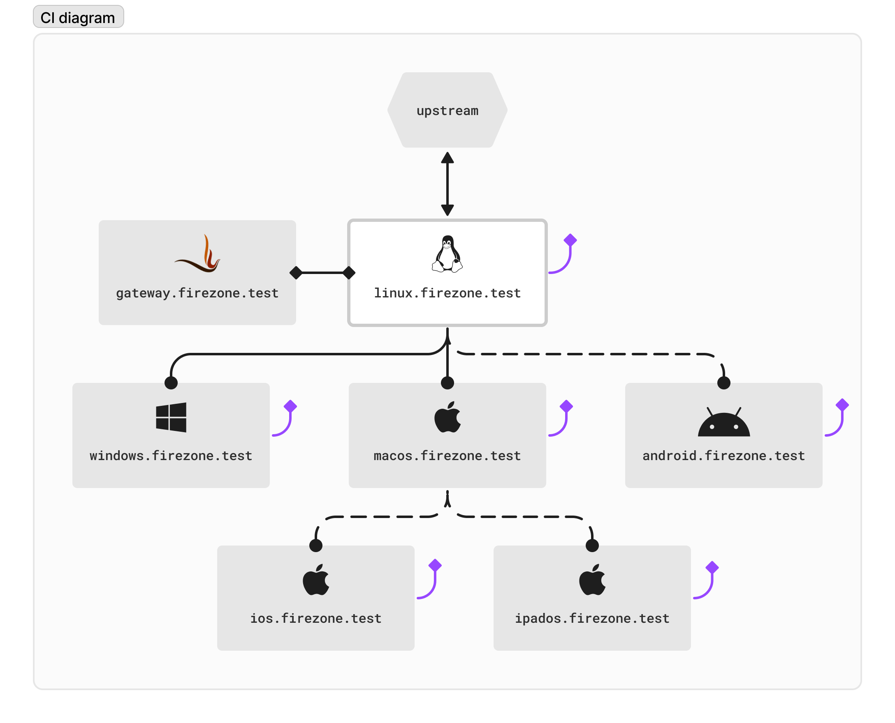

# End-to-end Tests

This directory contains our suite of end-to-end tests for the following clients,
running on baremetal hardware:

- Windows
- Android
- ChromeOS
- macOS
- iOS
- iPadOS

We use [Appium](https://appium.io) as our test orchestrator because it supports
all of the above platforms with a consistent architecture and test language.

## Running

You shouldn't run these tests yourself. Instead, these tests are intended to be
run from our bare metal testbed running in the Firezone HQ. See the
[e2e.yml](../.github/workflows/e2e.yml) workflow for how these tests are
triggered and run.

## Architecture

Our baremetal testbed consists of the following hardware:

| Hostname                 | Purpose                                               | OS / Model                  | CPU                    | RAM                  | Disk            | Network                                |
| ------------------------ | ----------------------------------------------------- | --------------------------- | ---------------------- | -------------------- | --------------- | -------------------------------------- |
| `linux.firezone.test`    | Orchestration server + Android / ChromeOS test runner | Ubuntu 22.04                | Ryzen 5950x            | 128 GB DDR4 3200 ECC | 500 GB NVMe SSD | 10 GbE internet uplink + 1 GbE testnet |
| `macos.firezone.test`    | macOS, iPadOS, iOS test driver                        | macOS 14                    | Apple M1               | 8 GB                 | 256 GB          | 1 GbE testnet + WiFi 6                 |
| `windows.firezone.test`  | Windows test driver                                   | Windows 11 Home             | Intel i3-1115G4        | 8 GB                 | 256 GB          | 1 GbE testnet + WiFi 6                 |
| `ios.firezone.test`      | iOS test client                                       | iOS 17                      | A14 Bionic (iPhone 12) | 4 GB                 | 128 GB          | WiFi 6                                 |
| `ipados.firezone.test`   | iPadOS test client                                    | iPadOS 17                   | A12 (iPad 8th gen)     | 3 GB                 | 128 GB          | 802.11ax WiFi                          |
| `android.firezone.test`  | Android test client                                   | Android 14 (Pixel 6)        | Tensor SoC             | 8 GB                 | 128 GB          | WiFi 6                                 |
| `chromeos.firezone.test` | ChromeOS test client                                  | ChromeOS 14 (Acer Spin 311) | Kompanio 500           | 4 GB                 | 64 GB           | WiFi 6                                 |

## Topology

Since we can't run the test driver directly on mobile platforms, we run it on
the host instead and connect over USB to the client. iOS/iPadOS clients are
tested from the `macos.firezone.test` host, and the Android/ChromeOS clients are
tested from the `linux.firezone.test` host.

### Network diagram

### Addressing

| Host                     | Interface        | IPv4 Address  | IPv6 Address |
| ------------------------ | ---------------- | ------------- | ------------ |
| `linux.firezone.test`    | egress           | `192.168.1.1` | TODO         |
| `linux.firezone.test`    | testnet ethernet | `10.0.0.1`    | TODO         |
| `macos.firezone.test`    | testnet ethernet | `10.0.0.2`    | TODO         |
| `windows.firezone.test`  | testnet ethernet | `10.0.0.3`    | TODO         |
| `linux.firezone.test`    | testnet WiFi     | `10.0.1.1`    | TODO         |
| `macos.firezone.test`    | testnet WiFi     | `10.0.1.2`    | TODO         |
| `windows.firezone.test`  | testnet WiFi     | `10.0.1.3`    | TODO         |
| `ios.firezone.test`      | testnet WiFi     | `10.0.1.4`    | TODO         |
| `ipados.firezone.test`   | testnet WiFi     | `10.0.1.5`    | TODO         |
| `android.firezone.test`  | testnet WiFi     | `10.0.1.6`    | TODO         |
| `chromeos.firezone.test` | testnet WiFi     | `10.0.1.7`    | TODO         |
