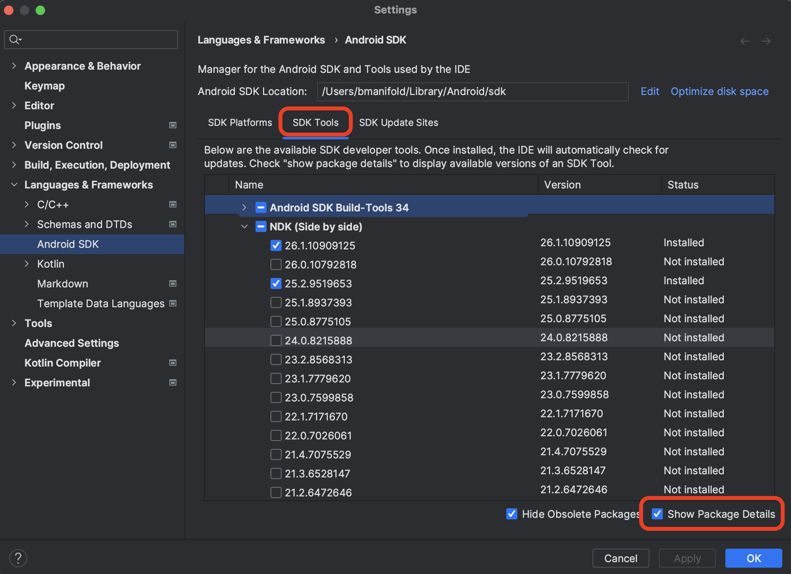

# Firezone Android client

This README contains instructions for building and testing the Android client
locally.

## Dev Setup

1. [Install Rust](https://www.rust-lang.org/tools/install)

1. [Install Android Studio](https://developer.android.com/studio)

1. Install your JDK 17 of choice. We recommend just
   [updating your CLI](https://stackoverflow.com/questions/43211282/using-jdk-that-is-bundled-inside-android-studio-as-java-home-on-mac)
   environment to use the JDK bundled in Android Studio to ensure you're using
   the same JDK on the CLI as Android Studio.

1. Install the Android SDK through Android Studio.
   - Open Android studio, go to Android Studio > Preferences
   - Search for `sdk`
   - Find the `Android SDK` nav item under `System Settings` and select
   - Click the `Edit` button next to the `Android SDK Location` field
   - Follow the steps presented to install Android SDK

1. Install `NDK` using Android Studio

   To see which version is installed, make sure to select the
   `Show Package Details` checkbox in the `Android SDK` settings page in Android
   Studio

   

   Make sure the correct NDK version is installed by looking at:
   `./app/build.gradle.kts`

1. Set the following properties in your `local.properties` file:

   ```
   sdk.dir=/Users/<username>/Library/Android/sdk
   ```

1. Make sure the following Rust targets are installed into the correct
   toolchain.

   ```
   aarch64-linux-android
   arm-linux-androideabi
   armv7-linux-androideabi
   i686-linux-android
   x86_64-linux-android
   ```

   Ensure you've activated the correct toolchain version for your local
   environment with `rustup default <toolchain>` (find this from the root
   `/rust/rust-toolchain.toml` file), then run:

   ```
   rustup target add aarch64-linux-android arm-linux-androideabi armv7-linux-androideabi i686-linux-android x86_64-linux-android
   ```

1. Perform a test build: `./gradlew assembleDebug`.

If you get errors about `rustc` or `cargo` not being found, it can help to
explicitly specify the path to these in your shell environment. For example:

```
# ~/.zprofile or ~/.bash_profile
export RUST_ANDROID_GRADLE_RUSTC_COMMAND=$HOME/.cargo/bin/rustc
export RUST_ANDROID_GRADLE_CARGO_COMMAND=$HOME/.cargo/bin/cargo
```

## Release Setup

We release from GitHub CI, so this shouldn't be necessary. But if you're looking
to test the `release` variant locally:

1. Download the keystore from 1Pass and save to `app/.signing/keystore.jks` dir.
1. Download firebase credentials from 1Pass and save to
   `app/.signing/firebase.json`
1. Now you can execute the `*Release` tasks with:

```shell
export KEYSTORE_PATH="$(pwd)/app/.signing/keystore.jks"
export FIREBASE_CREDENTIALS_PATH="$(pwd)/app/.signing/firebase.json"
HISTCONTROL=ignorespace # prevents saving the next line in shell history
 KEYSTORE_PASSWORD='keystore_password' KEYSTORE_KEY_PASSWORD='keystore_key_password' ./gradlew assembleRelease
```

### Minification and Symbol Upload

Release builds have R8 minification enabled to reduce APK size by ~30-40%.
The minification configuration includes:

- **ProGuard Rules**: Comprehensive rules in `app/proguard-rules.pro` protect:
  - UniFFI-generated Rust FFI bindings (`uniffi.connlib.**`)
  - JNI native methods and library loading
  - Firebase Crashlytics
  - Retrofit, Moshi, OkHttp (API layer)
  - Hilt/Dagger (dependency injection)
  - Android components (VpnService, ViewModel, etc.)

- **Symbol Upload**: Release builds automatically upload:
  - ProGuard mapping files to Firebase Crashlytics (via `uploadCrashlyticsSymbolFileRelease`)
  - Native debug symbols to Firebase Crashlytics (via `nativeSymbolUploadEnabled`)
  - Rust debug symbols to Sentry

The mapping file allows crash reports to be deobfuscated, showing the original
class and method names in stack traces. Rust debug symbols are preserved in
release builds via the `[profile.release.package.client-ffi]` configuration
in `/rust/Cargo.toml`.

## Logs

To see all connlib related logs via ADB use:

```
adb logcat --format color "connlib *:S"
```

This will show logs of all levels from the `connlib` tag and silence logs from other tags (`*:S`).
