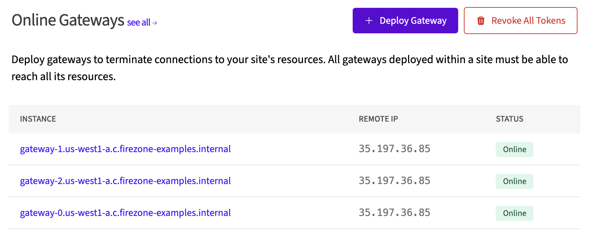

# GCP NAT Gateway Example

In this example, we will deploy one or more Firezone Gateways in a single VPC on
Google Cloud Platform (GCP) that are configured to egress traffic through a
single Cloud NAT that is assigned a single static IP address.

## Common use cases

Use this guide to give your Firezone Clients a static public IP address for
egress traffic to particular Resource(s). Here are some common use cases for
this example:

- Use IP whitelisting to access a third-party or partner application such as a
  client's DB or third-party API.
- Use IP whitelisting with your identity provider to lock down access to a
  public application.
- Enabling a team of remote contractors access to a regionally-locked
  application or service.

## High availability

All Firezone Gateways deployed in this example will automatically failover and
load balance for each other. No other configuration is necessary. To perform
upgrades with minimal downtime, see
[minimal downtime upgrades](#minimal-downtime-upgrades).

## Prerequisites

1. [Terraform](https://www.terraform.io/downloads.html)
1. [Google Cloud Platform (GCP) account](https://cloud.google.com/)
1. [Google Cloud SDK](https://cloud.google.com/sdk/docs/install)
1. [Enable the Compute Engine API](https://console.cloud.google.com/flows/enableapi?apiid=compute.googleapis.com)
1. A [Firezone Site](https://www.firezone.dev/kb/deploy/sites) dedicated to use
   for this example. This Site should contain **only** the Firezone Gateway(s)
   deployed in this example and any associated Resources.
1. A Firezone Gateway token. See
   [Multiple Gateways](https://www.firezone.dev/kb/deploy/gateways#deploy-multiple-gateways)
   for instructions on how to obtain a Firezone Gateway token that can be used
   across multiple instances.

## Sizing

Simply update the number of replicas to deploy more or fewer Firezone Gateways.
There's no limit to the number of Firezone Gateways you can deploy in a single
VPC.

We've tested with `f1-micro` instances which still work quite well for most
applications. However, you may want to consider a larger instance type if you
have a high volume of traffic or lots of concurrent connections.

## Deployment

1. Configure the necessary Terraform
   [variables](https://developer.hashicorp.com/terraform/language/values/variables).
   Here's an example `terraform.tfvars` you can use as a starting point:

   ```hcl
   project_id     = "my-gcp-project"
   region         = "us-west1"
   zone           = "us-west1-a"
   token          = "<YOUR GATEWAY TOKEN>"
   replicas       = 3
   machine_type   = "f1-micro"
   log_level      = "info"
   ```

1. Run `terraform init` to initialize the working directory and download the
   required providers.
1. Run `terraform apply` to deploy the Firezone Gateway(s) into your GCP
   project.

You can see the static IP address assigned to the Cloud NAT in the Terraform
output. This is the IP address that your Firezone Gateway(s) will use to egress
traffic.

You can verify all Firezone Gateways are using this IP by viewing the Site in
the Firezone admin portal, where you should now see the Firezone Gateway(s)
listed as `Online`.

<center>



</center>

## Upgrading

To upgrade the Firezone Gateway(s) to the latest version, simply update the
`token` and issue a `terraform apply` which will trigger a redeployment of the
Firezone Gateway(s).

This will incur about a minute or two of downtime as Terraform destroys the
existing Firezone Gateway(s) and deploys new ones in their place.

### Minimal downtime upgrades (optional)

To achieve a minimal downtime upgrade, add more
`google_compute_instance_template`s, each with their own `token`. When it comes
time to upgrade, update the `token` variable for each one individually, issuing
a `terraform apply` in between. We recommend 3 or more
`google_compute_instance_template`s if you plan to use this method.

This will ensure that at least two groups of Firezone Gateways are always online
and serving traffic as you roll over the old ones.
